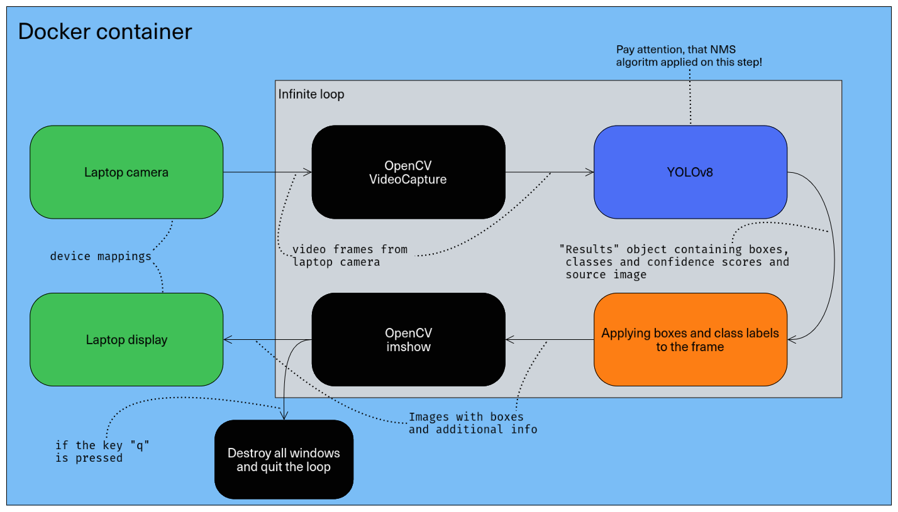

# Real-Time laptop camera object detection task
## Developed using opencv and YOLOv8 (ultralytics)

Main purpose of this project to represent my vision of prototyping solution for object detection task.

## Main features:
- Using OpenCV for capturing video from your device camera;
- Applying YOLOv8 for proceeding real-time object detection;
- Wrapping code in Docker container;
# Part 1: architecture

looking through large amount of the open-source solutions for object-detection, i decided to narrow down the search to YOLO and SSD architectures. A the context of primary task, detection of the object must be realized in the real-time conditions from the laptop camera video information. So, main criterions for choosing best solution are: 
- Resource usage;
- Speed;
- Simplicity;

In the table below, you can see main features of using YOLOv8 and MobileNet SSD v2:

| Feature | YOLOv8 | MovileNet SSD v2 |
| ------------ | ---------- | ----------------------------- |
| Efficiency | YOLO’s single-pass approach makes it veryfast and suitable for real-time applications. | SSD performs detection in a single pass, making it faster than multi-stage models like Faster R-CNN.|
| Simplicity | The unified architecture simplifies the model and training process. | SSD’s architecture is simpler compared to multi-stage models, which can make it easier to train and deploy. |
| Context | YOLO considers the entire image at once, which can aid in context-aware detection. | If your images contain cluttered or complex scenes with overlapping objects, SSD’s ability to handle multi-scale objects can be beneficial. |

According to the task, this solution is developed for laptops and other portable devices which computational resources are limited, and complexity of the scenes are oftenly not high. Because of all this facts, i decided to use YOLO architecture (YOLOv8) instead of using SSD (Mobilenet SSD v2), because it more important to make fast and resource efficient solution to be deployed on portable devices such as laptop (for example: my personal laptop has Ryzen 5 (3th gen) and 8 GB RAM).

UML Sequence diagram represents ordered interactions between functional objects of the prototype.


Another point of view about this prototype you can see from diagram below:



## Tech

I used the following stack of technologies:

- [OpenCV](https://opencv.org/) - open source library for solving different CV tasks (video capturing and displaying).
- [ultralytics/YOLOv8](https://docs.ultralytics.com/modes/predict/#inference-sources) - python 3 library which contains YOLO models for different tasks.
- [Docker](https://www.docker.com/) - Docker is a platform designed to help developers build, share, and run container applications. We handle the tedious setup, so you can focus on the code.

# Part 2: coding

## Installation

Dillinger requires [python3.12+](https://python.org/) to run.

Install the dependencies and start the application.

```sh
git clone https://github.com/nesemenpolkov/objectdetectionyolov8.git
cd ./objectdetectionyolov8
pip install requirements.txt
python3 main.py
```


## Docker

This app is very easy to install and deploy localy in a Docker container.


```sh
cd ./objectdetectionyolov8
xhost +
docker build . -t objectdetection
```

This will create the docker image.

Once done, run the Docker image and map device(camera), display and xorg volume for correct operation:

```sh
docker run --device /dev/video0:/dev/video0 --net=host -e DISPLAY=$DISPLAY -v /tmp/.X11-unix:/tmp/.X11-unix:rw objectdetection
```

> Note: `--device` is required for video capturing from your laptop, if you have several cameras, connected to your device, you can configure it manually. Use lspci or lsusb to search the right naming

Verify the deployment by opening window, displaying your camera`s video with detected objects

In the .env file you can pass arguments to the contaners enviroment:
```sh
DEVICE="cuda" 
DEVICE_INDEX=0

IMG_WIDTH=640
IMG_HEIGHT=480

AGNOSTIC_NMS="True"
IOU=0.75

USE_HALF="False"
```
Where:
- DEVICE - is a device, where your data will be processed (cuda or cpu);
- DEVICE_INDEX - if you have several GPU`s installed in your hardware platform, you can select exact device by specifying its number;
- IMG_WIDTH and IMG_HEIGHT - arguments for VideoCapture;
- AGNOSTIC_NMS - Enables class-agnostic Non-Maximum Suppression (NMS),which merges overlapping boxes of different classes. Useful in multi-class detection scenarios where class overlap is common;
- IOU - Intersection Over Union (IoU) threshold for Non-Maximum Suppression (NMS). Lower values result in fewer detections by eliminating overlapping boxes, useful for reducing duplicates.
- USE_HALF - Enables half-precision (FP16) inference, which can speed up model inference on supported GPUs with minimal impact on accuracy.

To run docker container with arguments, use:
```sh
docker run --device /dev/video0:/dev/video0 --net=host -e DISPLAY=$DISPLAY -v /tmp/.X11-unix:/tmp/.X11-unix:rw --env-file ./.env objectdetection
```

## License

MIT

**Free Software!**
